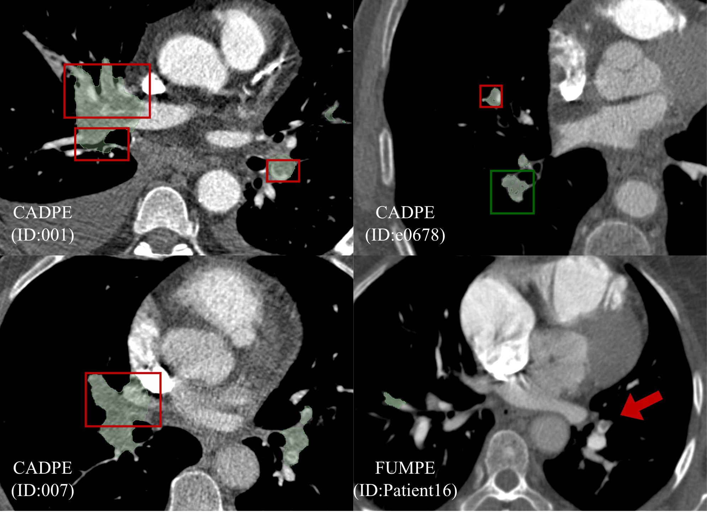

<div align="center">

# 🫁 PEBench

**A unified reference standard, preprocessing pipeline, and evaluation toolkit for<br>pulmonary embolism (PE) segmentation on CT pulmonary angiography (CTPA)**

[](https://opensource.org/licenses/MIT)
[](https://creativecommons.org/licenses/by/4.0/)
[](https://www.python.org/)
[](https://github.com/MIC-DKFZ/nnUNet)
[](#1-background)
[](#)

</div>

---

> [!IMPORTANT]
> 🔒 **All resources — labels, weights, splits, and code — will be made public after the paper is accepted.**
> This repository is a placeholder until then.

---

## 📦 What's in this repository

| File | Purpose |
|:---|:---|
| 🧩 `pre_totalseg.py` | TotalSegmentator-based lung cropping + nnU-Net v2 raw dataset construction |
| 📊 `evaluate.py` | Four-dimensional evaluation (voxel / boundary / volumetric / lesion-level) |

Two resources accompany the paper:

| Resource | Description |
|:---|:---|
| ⚖️ **FairPE** | All three public pixel-level PE segmentation datasets re-annotated under a single, pre-defined protocol (**149 cases**), released as preprocessed CTPA volumes with matched labels — ready for nnU-Net training. |
| 🧠 **nnPE** | nnU-Net 3D ResEncL baseline weights trained on the re-annotated labels, released with the exact five-fold splits used in the paper. |

---

## 🗂️ Table of contents

- [1. Background](#1--background)
- [2. Preprocessing — `pre_totalseg.py`](#2--preprocessing--pre_totalsegpy)
- [3. Training — nnU-Net 3D ResEncL](#3--training--nnu-net-3d-resencl)
- [4. Evaluation — `evaluate.py`](#4--evaluation--evaluatepy)
- [5. Release and citation](#5--release-and-citation)

---

## 1. 🔍 Background

Three publicly available datasets provide pixel-level PE annotations on CTPA:

| Dataset | Cases released | Cases in FairPE | Source |
|:---|:---:|:---:|:---|
| 🅰️ CAD-PE | 91 | 76 | Gonzalez Serrano G. *CAD-PE*. IEEE Dataport, 2019. · [DOI](https://doi.org/10.21227/9bw7-6823) |
| 🅱️ FUMPE | 35 | 33 | Masoudi M, et al. *Sci Data* 2018;5:180180. · [DOI](https://doi.org/10.1038/sdata.2018.180) |
| 🅲 READ | 40 | 40 | de Andrade JMC, et al. *Sci Data* 2023;10:518. · [DOI](https://doi.org/10.1038/s41597-023-02374-x) |
| **Σ Total** | **166** | **149** | |

> [!NOTE]
> **Seventeen cases were excluded before re-annotation:** no PE visible on CTPA, reconstructed slice interval ≥ 3 mm, or artefacts severe enough that no rater could delineate the scan. The excluded case IDs are listed in the release.

### ⚠️ Why re-annotation is needed

Each dataset was produced independently, by different teams, for different purposes, and under its own annotation convention. The conventions differ in ways that are entirely reasonable in isolation but that do not coincide across datasets:

- 🔬 whether **subsegmental lesions** are included
- ✏️ how the **thrombus–contrast interface** is drawn
- 🧱 how **partial-volume voxels** at vessel margins are assigned
- 🖐️ whether delineation was **fully manual or semi-automatic**

The consequence is practical rather than critical — a model trained on one dataset is evaluated against a different definition of the target when tested on another, and reported numbers from different papers are not on a common scale.

<p align="center">
  
</p>
<p align="center">
  <em>Representative regions where the original public annotation and the re-annotation under the unified protocol differ: extension into the opacified arterial lumen or adjacent veins, internal voids within an annotated clot, and lesions present on the image but absent from the mask.</em>
</p>

Re-annotating all three datasets under one protocol places them on the same footing. 📋 The protocol used is given in the paper (Supplementary Material S1) and is reproduced in [`docs/annotation_protocol.md`](docs/annotation_protocol.md).

### 🗺️ Spatial distribution of clot burden

The three cohorts also sample different parts of the clinical PE spectrum. The voxel-wise embolus density maps below, computed after registration to a common lung template, show the spatial distribution of clot burden per dataset and pooled:

<p align="center">
  
</p>
<p align="center">
  <em>Voxel-wise embolus density per dataset and pooled (ALL). Top: anterior view of the lung volume. Middle: medial (mediastinal) surface. Bottom: pulmonary-arterial surface. Color bars encode local voxel count. R/L = right/left lung.</em>
</p>

---

## 2. 🧩 Preprocessing — `pre_totalseg.py`

Converts raw CT + segmentation label pairs into a lung-cropped [nnU-Net](https://github.com/MIC-DKFZ/nnUNet) v2 raw dataset.

### ⚙️ What it does

1. 🔗 Pairs each CT (`.nii`/`.nii.gz`) with its label (`.nrrd`) by matching filename, scanning the input folder recursively.
2. 🫁 Runs [TotalSegmentator](https://github.com/wasserth/TotalSegmentator) to get a lung mask for each CT.
3. ✂️ Computes a bounding box around the lungs (with a configurable margin) and crops both the CT and the label to it.
4. 💾 Saves the cropped pairs into `imagesTr/` / `labelsTr/` in nnU-Net naming convention, and generates `dataset.json`.
5. 📝 Writes `crop_info.json` recording each case's bounding box and foreground voxel counts before/after cropping.

> 🎯 **Purpose:** shrink full CT volumes down to just the lung region before nnU-Net training, cutting memory/compute cost while keeping the region of interest (e.g. pulmonary embolism lesions) intact.

The FairPE release already contains the output of this step for all 149 cases; the script is provided so that new cohorts can be processed identically before training or inference with nnPE.

### ▶️ Usage

```bash
python pre_totalseg.py \
    -i /path/to/raw_data \
    -o /path/to/nnUNet_raw \
    --dataset_name Dataset080_3DPECT \
    --margin 10 \
    -n 4
```

| Flag | Required | Default | Description |
|:---|:---:|:---:|:---|
| `-i`, `--input` | ✅ | – | Root directory of raw `.nii`/`.nii.gz` + `.nrrd` files |
| `-o`, `--output` | ✅ | – | Output root directory (`nnUNet_raw`) |
| `--dataset_name` | ✅ | – | Dataset folder name, e.g. `Dataset080_3DPECT` |
| `--margin` | ❌ | `10` | Voxel margin added around the lung bounding box |
| `-n`, `--n_processes` | ❌ | `4` | Parallel worker processes |

> [!TIP]
> The script processes one sample first as a **smoke test**, then asks for confirmation before batch-processing the rest. Cases with bad/mismatched files are skipped and reported rather than aborting the run; re-running skips cases already done. ♻️

### 📁 Output

```
<output>/<dataset_name>/
├── imagesTr/
├── labelsTr/
├── crop_info.json
└── dataset.json
```

### ⏭️ Next steps

```bash
python create_splits.py -d <output>/<dataset_name> --folds 5
nnUNetv2_plan_and_preprocess -d <DATASET_ID> --verify_dataset_integrity
```

---

## 3. 🧠 Training — nnU-Net 3D ResEncL

nnPE uses the nnU-Net v2 residual encoder preset **3D ResEncL** with default configuration, one exception aside (batch size, below). No transfer learning; weights are randomly initialized with the nnU-Net v2 default scheme.

### 🛠️ Environment

```bash
pip install nnunetv2
export nnUNet_raw="/path/to/nnUNet_raw"
export nnUNet_preprocessed="/path/to/nnUNet_preprocessed"
export nnUNet_results="/path/to/nnUNet_results"
```

### 📐 Planning and preprocessing

```bash
nnUNetv2_plan_and_preprocess -d 80 -pl nnUNetPlannerResEncL --verify_dataset_integrity
```

> [!WARNING]
> ⚡ Batch size was set to `2` to fit a **40 GB GPU**. Edit the `3d_fullres` configuration in
> `$nnUNet_preprocessed/Dataset080_3DPECT/nnUNetResEncUNetLPlans.json`:

```json
"configurations": {
  "3d_fullres": {
    "batch_size": 2
  }
}
```

Then copy the released `splits_final.json` into `$nnUNet_preprocessed/Dataset080_3DPECT/` so that the folds match the paper exactly. 🎲 Splits are stratified by dataset source, with each fold's validation subset sampled proportionally from each constituent dataset and no case appearing in more than one validation fold.

### 🏋️ Training

```bash
for FOLD in 0 1 2 3 4; do
  nnUNetv2_train 80 3d_fullres $FOLD -p nnUNetResEncUNetLPlans
done
```

### 🔮 Inference

Predictions are generated by ensembling the five fold models:

```bash
nnUNetv2_predict \
  -i /path/to/imagesTs \
  -o /path/to/predictions \
  -d 80 -c 3d_fullres -p nnUNetResEncUNetLPlans \
  -f 0 1 2 3 4
```

> [!CAUTION]
> Inputs **must** be preprocessed with `pre_totalseg.py` first, so that the lung crop matches the training distribution.

### 📦 Released configurations

| Configuration | Training data | Intended use |
|:---|:---|:---|
| 🌍 `nnPE_ABC` | CAD-PE + FUMPE + READ | General-purpose baseline / fine-tuning checkpoint |
| 🎯 `nnPE_AB` | CAD-PE + FUMPE | Zero-shot evaluation on READ |
| 🎯 `nnPE_AC` | CAD-PE + READ | Zero-shot evaluation on FUMPE |
| 🎯 `nnPE_BC` | FUMPE + READ | Zero-shot evaluation on CAD-PE |

Each configuration ships all five fold checkpoints plus its `splits_final.json`.

---

## 4. 📊 Evaluation — `evaluate.py`

Segmentation quality is reported across **four complementary dimensions**.

> [!NOTE]
> All metrics are computed **per volume**, on the full scan. Slice-level evaluation and evaluation restricted to positive slices are *not* interchangeable with volume-level evaluation and are not supported here.

<div align="center">

| | Dimension | Metrics |
|:---:|:---|:---|
| 🔲 | Voxel-level overlap | DSC |
| 📏 | Boundary accuracy | ASSD, NSD |
| 🧪 | Volumetric agreement | AbsErr (mL) |
| 🎯 | Lesion-level detection | Precision, Recall, F1 |

</div>

### 🔲 Voxel-level overlap

Dice similarity coefficient, from binary predictions:

$$\mathrm{DSC} = \frac{2\,TP}{2\,TP + FP + FN}$$

### 📏 Boundary accuracy

**ASSD** — the mean bidirectional surface distance in millimetres, where $\partial P$ and $\partial G$ are the predicted and reference surface point sets and $d(\cdot,\cdot)$ the minimum Euclidean point-to-surface distance:

$$\mathrm{ASSD} = \frac{1}{2}\left(\frac{1}{|\partial P|}\sum_{p \in \partial P} d(p, \partial G) + \frac{1}{|\partial G|}\sum_{g \in \partial G} d(g, \partial P)\right)$$

**NSD** — the proportion of surface points on each side lying within tolerance $\tau$ of the opposing surface, averaged bidirectionally:

$$\mathrm{NSD}(\tau) = \frac{1}{2}\left(\frac{|\{p \in \partial P : d(p,\partial G) \le \tau\}|}{|\partial P|} + \frac{|\{g \in \partial G : d(g,\partial P) \le \tau\}|}{|\partial G|}\right)$$

> 💡 The default tolerance is $\tau = 1$ mm, chosen to sit near the centre of the observed inter-rater ASSD range so that the metric separates boundary error from disagreement already present between experts.

### 🧪 Volumetric agreement

Absolute volume error, $\mathrm{AbsErr} = |V_{\text{pred}} - V_{\text{gt}}|$, from voxel counts scaled by voxel volume (mL).

### 🎯 Lesion-level detection

A two-stage, volume-aware framework, evaluated at overlap thresholds $X \in \{1\ \text{pixel},\ 10\%,\ 20\%\}$.

1. Each **predicted** embolus is a true positive ($TP_L$) if $|P \cap G| / |P| \ge X$, otherwise a false positive ($FP_L$).
2. Each **reference** embolus is detected if its overlap with $TP_L$ components satisfies $|P \cap G| / |G| \ge X$, otherwise a false negative ($FN_L$).

$$\text{Lesion Precision}(X) = \frac{TP_L}{TP_L + FP_L},\qquad \text{Lesion Recall}(X) = \frac{TP_L}{N_{gt}}$$

Lesion F1 is defined symmetrically, as the harmonic mean of the two directional recalls:

$$\text{Lesion F1}(X) = \frac{2 \cdot R_{A \to B}(X) \cdot R_{B \to A}(X)}{R_{A \to B}(X) + R_{B \to A}(X)}$$

> [!TIP]
> When $B$ is the reference standard this reduces to the conventional F1. 🤝 The symmetric form lets the same metric be applied to **inter-rater agreement**, where $A$ and $B$ are two raters of equivalent status — useful because voxel-overlap metrics such as DSC are geometrically biased against small lesions and are therefore unreliable as stand-alone agreement measures for PE.

Connected-component analysis is used to define individual emboli; components smaller than **2 mm³** are removed as annotation noise. All statistics are computed at the native voxel spacing, without resampling.

### ▶️ Usage

```bash
python evaluate.py \
    -p /path/to/predictions \
    -g /path/to/reference_labels \
    -o results.csv \
    --nsd_tau 1.0 \
    --lesion_thresholds 1px 0.1 0.2
```

📄 Per-case values are written to `results.csv`; a summary (mean ± SD per metric, overall and per dataset) is printed to stdout.

---

## 5. 📜 Release and citation

### 🎁 What is released

<table>
<tr><td width="80" align="center">⚖️<br><b>FairPE</b></td><td>

The preprocessed CTPA volumes and matched re-annotated PE reference segmentations for all **149 included cases** across CAD-PE, FUMPE and READ, produced under the unified protocol, together with the case-selection list, the annotation protocol, and the **15-case multi-rater subset** with four independent raters and their STAPLE consensus. Distributed via Zenodo with a citable DOI.

</td></tr>
<tr><td align="center">🧠<br><b>nnPE</b></td><td>

nnU-Net 3D ResEncL weights for the pooled (**ABC**) and three leave-one-dataset-out (**AB**, **AC**, **BC**) configurations, five folds each, with the corresponding `splits_final.json` for every configuration.

</td></tr>
<tr><td align="center">💻<br><b>Code</b></td><td>

`pre_totalseg.py`, `evaluate.py`, and the reproduction scripts for the paper's tables and figures.

</td></tr>
</table>

The source datasets are publicly released for research use under terms that permit redistribution and derivative works with attribution; that attribution requirement is why citing all three sources is mandatory.

### 📌 Citation requirements

> [!IMPORTANT]
> Because FairPE is a **derivative annotation layer** over existing public data, any use of the labels or the weights must cite **all three source datasets** in addition to this work.

<details>
<summary>📚 <b>Source datasets</b> — CAD-PE, FUMPE, READ <i>(required)</i></summary>

```bibtex
@misc{cadpe,
  author = {Gonzalez Serrano, Germ{\'a}n},
  title  = {CAD-PE},
  year   = {2019},
  publisher = {IEEE Dataport},
  doi    = {10.21227/9bw7-6823}
}

@article{fumpe,
  author  = {Masoudi, Mojtaba and Pourreza, Hamid-Reza and Saadatmand-Tarzjan, Mahdi and Eftekhari, Noushin and Zargar, Fateme Shafiee and Rad, Masoud Pezeshki},
  title   = {A new dataset of computed-tomography angiography images for computer-aided detection of pulmonary embolism},
  journal = {Scientific Data},
  volume  = {5},
  pages   = {180180},
  year    = {2018},
  doi     = {10.1038/sdata.2018.180}
}

@article{read,
  author  = {de Andrade, Jo{\~a}o Marcos Cardoso and Olescki, Gabriel and Escuissato, Dante Luiz and Oliveira, Lucas Ferrari and Basso, Ana Carolina Nicolleti and Salvador, Gabriel Lucca},
  title   = {Pixel-level annotated dataset of computed tomography angiography images of acute pulmonary embolism},
  journal = {Scientific Data},
  volume  = {10},
  pages   = {518},
  year    = {2023},
  doi     = {10.1038/s41597-023-02374-x}
}
```

</details>

<details>
<summary>🛠️ <b>Tooling</b> — TotalSegmentator, nnU-Net, nnU-Net Revisited <i>(conditionally required)</i></summary>

Use of `pre_totalseg.py` additionally requires citing **TotalSegmentator**; use of the nnPE weights or the training recipe additionally requires citing **nnU-Net** *and*, because nnPE uses the residual encoder preset, ***nnU-Net Revisited***.

```bibtex
@article{totalsegmentator,
  author  = {Wasserthal, Jakob and Breit, Hanns-Christian and Meyer, Manfred T. and Pradella, Maurice and Hinck, Daniel and Sauter, Alexander W. and others},
  title   = {TotalSegmentator: Robust segmentation of 104 anatomic structures in CT images},
  journal = {Radiology: Artificial Intelligence},
  volume  = {5},
  number  = {5},
  pages   = {e230024},
  year    = {2023},
  doi     = {10.1148/ryai.230024}
}

@article{nnunet,
  author  = {Isensee, Fabian and Jaeger, Paul F. and Kohl, Simon A. A. and Petersen, Jens and Maier-Hein, Klaus H.},
  title   = {nnU-Net: a self-configuring method for deep learning-based biomedical image segmentation},
  journal = {Nature Methods},
  volume  = {18},
  number  = {2},
  pages   = {203--211},
  year    = {2021},
  doi     = {10.1038/s41592-020-01008-z}
}

@inproceedings{nnunet_revisited,
  author    = {Isensee, Fabian and Wald, Tassilo and Ulrich, Constantin and Baumgartner, Michael and Roy, Saikat and Maier-Hein, Klaus H. and Jaeger, Paul F.},
  title     = {nnU-Net Revisited: A Call for Rigorous Validation in {3D} Medical Image Segmentation},
  booktitle = {Medical Image Computing and Computer Assisted Intervention (MICCAI) 2024},
  series    = {LNCS},
  volume    = {15009},
  publisher = {Springer},
  year      = {2024},
  note      = {arXiv:2404.09556}
}
```

</details>

<details open>
<summary>⭐ <b>This work</b></summary>

```bibtex
@article{fairpe,
  title   = {[Title withheld during peer review]},
  author  = {[Anonymous]},
  journal = {[Under review]},
  year    = {2026}
}
```

</details>

### 📄 Licence

| Component | Licence |
|:---|:---|
| 💻 Code | [MIT](https://opensource.org/licenses/MIT) |
| ⚖️ Re-annotated labels & preprocessed volumes | [CC BY 4.0](https://creativecommons.org/licenses/by/4.0/) |

Users remain bound by the terms of the three source datasets.

---

<div align="center">

🔒 **All resources — labels, weights, splits, and code — will be made public after the paper is accepted.**

<sub>If you find PEBench useful, please consider giving the repository a ⭐</sub>

</div>
