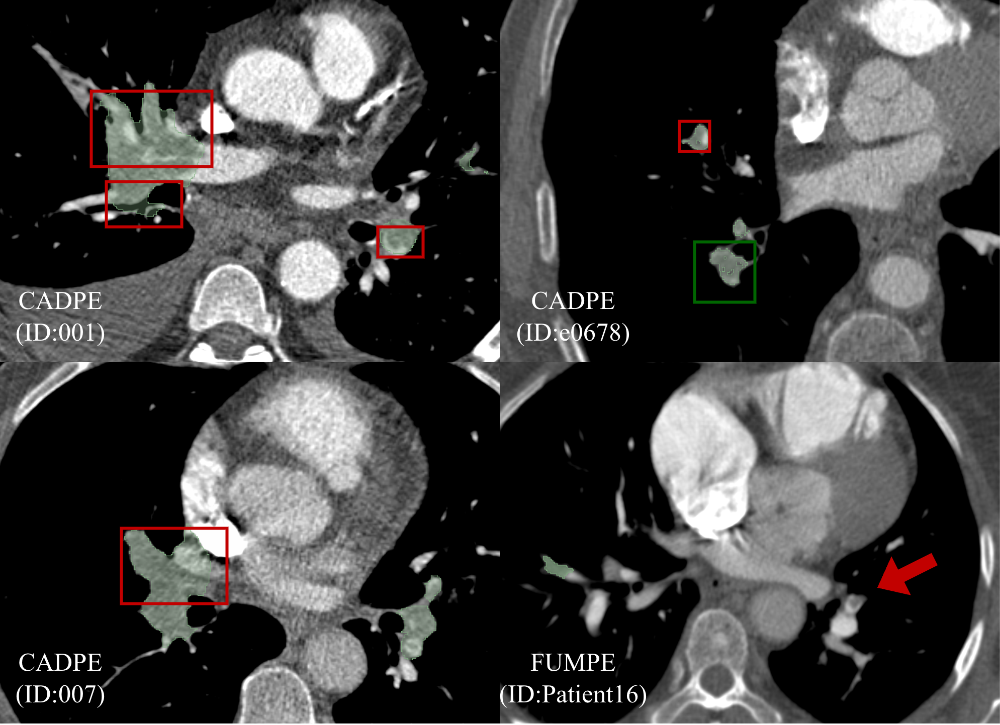

<div align="center">

# 🫁 PEBench

**A unified reference standard, preprocessing pipeline, and evaluation toolkit for<br>pulmonary embolism (PE) segmentation on CT pulmonary angiography (CTPA)**

[](https://opensource.org/licenses/MIT)
[](https://creativecommons.org/licenses/by/4.0/)
[](https://www.python.org/)
[](https://github.com/MIC-DKFZ/nnUNet)
[](#1--background)
[](#)

</div>

---

> [!IMPORTANT]
> 🔒 **All resources — labels, weights, splits, and code — will be made public after the papers are accepted.**
> This repository is a placeholder until then.

---

## 📦 What's in this repository

| File | Purpose |
|:---|:---|
| 🔄 `convert_public_pe_to_nifti.py` | Convert the three public datasets from their native formats into nnU-Net style NIfTI |
| 🧩 `pre_totalseg.py` | TotalSegmentator-based lung cropping + nnU-Net v2 raw dataset construction |
| 🎲 `create_splits.py` | Five-fold splits stratified by source dataset |
| 📊 `evaluate.py` | Four-dimensional evaluation (voxel / boundary / volumetric / lesion-level) |
| 📋 `docs/annotation_protocol.md` | The annotation protocol, as applied to all 149 cases |

Two resources accompany the papers:

| Resource | Description |
|:---|:---|
| ⚖️ **FairPE** | All three public pixel-level PE segmentation datasets annotated under a single, pre-defined protocol (**149 cases**), released as preprocessed CTPA volumes with matched labels — ready for nnU-Net training. |
| 🧠 **nnPE** | nnU-Net 3D ResEncL baseline weights trained on the harmonized labels, released with the exact five-fold splits used in the paper. |

---

## 🗂️ Table of contents

- [1. Background](#1--background)
- [2. Format conversion — `convert_public_pe_to_nifti.py`](#2--format-conversion--convert_public_pe_to_nifitpy)
- [3. Preprocessing — `pre_totalseg.py`](#3--preprocessing--pre_totalsegpy)
- [4. Training — nnU-Net 3D ResEncL](#4--training--nnu-net-3d-resencl)
- [5. Evaluation — `evaluate.py`](#5--evaluation--evaluatepy)
- [6. Release and citation](#6--release-and-citation)

---

## 1. 🔍 Background

Three publicly available datasets provide pixel-level PE annotations on CTPA:

| Dataset | Cases released | Cases in FairPE | Licence | Source |
|:---|:---:|:---:|:---|:---|
| 🅰️ CAD-PE | 91 | 76 | IEEE DataPort terms | Gonzalez Serrano G. *CAD-PE*. IEEE DataPort, 2019. · [DOI](https://doi.org/10.21227/9bw7-6823) |
| 🅱️ FUMPE | 35 | 33 | CC BY 4.0 | Masoudi M, et al. *Sci Data* 2018;5:180180. · [DOI](https://doi.org/10.1038/sdata.2018.180) |
| 🅲 READ | 40 | 40 | CC0 1.0 | de Andrade JMC, et al. *Sci Data* 2023;10:518. · [DOI](https://doi.org/10.1038/s41597-023-02374-x) |
| **Σ Total** | **166** | **149** | | |

> [!NOTE]
> **Seventeen cases were excluded before annotation:** no PE visible on CTPA (n = 5), reconstructed slice interval ≥ 3 mm (n = 10), or artefacts severe enough that no rater could delineate the scan (n = 2). The excluded case IDs are listed in the release and in the data descriptor.

### 📐 Why a single protocol

Each dataset was produced independently, by different teams, for different purposes, and under its own annotation convention. The conventions differ in ways that are entirely reasonable in isolation but that do not coincide across datasets:

- 🔬 whether **subsegmental lesions** are included
- ✏️ how the **thrombus–contrast interface** is drawn
- 🧱 how **partial-volume voxels** at vessel margins are assigned
- 🖐️ whether delineation was **fully manual or semi-automatic**

The consequence is practical rather than critical. A model trained on one dataset is evaluated against a different definition of the target when tested on another, and reported numbers from different papers are not on a common scale.

<p align="center">
  
</p>
<p align="center">
  <em>Representative regions where the source annotation and the harmonized annotation differ: source foreground extending into the opacified arterial lumen or adjacent veins, internal voids within an annotated clot, and emboli present on the image but absent from the source mask.</em>
</p>

Annotating all three datasets under one protocol places them on the same footing. 📋 The protocol is reproduced in full in the Methods section of the data descriptor and in [`docs/annotation_protocol.md`](docs/annotation_protocol.md).

### 🗺️ Spatial distribution of clot burden

The three cohorts also sample different parts of the clinical PE spectrum. The maps below show the spatial distribution of clot burden per dataset and pooled:

<p align="center">
  
</p>
<p align="center">
  <em>Embolus density per dataset and pooled (ALL), after structure-wise mapping into a common reference space. Because image registration is not reliable across these heterogeneous acquisition protocols, coordinates were normalized within the bounding box of each structure rather than registered. Top: anterior view of the lung volume. Middle: medial (mediastinal) surface. Bottom: pulmonary-arterial surface. Colors show <b>relative</b> embolus density on a nonlinear scale (γ = 0.25), with separate scales for the lung lobes and the pulmonary artery, each shared across datasets. Densities are not normalized by cohort size, so datasets should be compared by spatial pattern rather than by overall intensity. R/L = right/left lung.</em>
</p>

---

## 2. 🔄 Format conversion — `convert_public_pe_to_nifti.py`

The three datasets ship in three different formats. This script converts them into a single nnU-Net style NIfTI layout, resolving the orientation and slice-order quirks of each source.

### 📥 Expected raw layout

```
<raw_root>/
├── CAD-PE/images/001.nrrd                     + CAD-PE/rs/0001RefStd.nrrd
├── FUMPE/CT_scans/PAT001/*.dcm                + FUMPE/GroundTruth/PAT001.mat
└── READ/images/GE (DICOM files)/01GE          + READ/rs/01GE.nii.gz
    READ/images/TOSHIBA (DICOM files)/01TS     + READ/rs/01TS.nii.gz
```

### 🧭 What it handles per dataset

| Source | Image | Label | Handling |
|:---|:---|:---|:---|
| 🅰️ CAD-PE | NRRD | NRRD (`RefStd`) | The reference stores one value per clot; all non-zero voxels are merged into a single foreground label. |
| 🅱️ FUMPE | DICOM series | MATLAB `.mat`, key `Mask` | The mask is stored as (y, x, z) and its slices follow the DICOM **file names**, while GDCM sorts slices by **physical position**. The mask is transposed to (z, y, x) and reordered into the image slice order, which reverses it for the cases whose file-name order runs against the position order. |
| 🅲 READ | DICOM series | NIfTI | The image array and the label array are index-aligned, but their headers disagree on slice direction. The image is written with the geometry of the label header and the voxel spacing of the DICOM tags, the latter being the more precise of the two. |

### 📤 Output

```
<out>/
├── imagesTr/<case>_0000.nii.gz    # int16 CT
└── labelsTr/<case>.nii.gz         # uint8, 0/1
```

Case naming: CAD-PE `001` → `pe_001_001`, CAD-PE `e0032` → `pe_e0032_e0032`, FUMPE `PAT001` → `pe_Patient01_Patient01`, READ `01GE` → `01GE`. Each stem embeds the identifier used by the source dataset, so every case can be traced back to the file it came from.

### ▶️ Usage

```bash
python convert_public_pe_to_nifti.py --raw /path/to/raw_root --out /path/to/converted
python convert_public_pe_to_nifti.py --raw ... --out ... --datasets READ --workers 8
```

| Flag | Required | Default | Description |
|:---|:---:|:---:|:---|
| `--raw` | ✅ | – | Raw data root containing `CAD-PE/`, `FUMPE/`, `READ/` |
| `--out` | ✅ | – | Output directory (`imagesTr/`, `labelsTr/`) |
| `--datasets` | ❌ | all three | Subset to convert, e.g. `--datasets READ FUMPE` |
| `--workers` | ❌ | `4` | Parallel worker processes |

> [!TIP]
> The run is resumable: cases whose outputs already exist are skipped. ♻️ Shape mismatches and missing labels are reported per case and listed again at the end rather than aborting the run.

---

## 3. 🧩 Preprocessing — `pre_totalseg.py`

Crops CT and label pairs to the thoracic region and builds the nnU-Net v2 raw dataset.

> [!NOTE]
> This step pairs each CT (`.nii`/`.nii.gz`) with a label in **`.nrrd`**, which is the format exported by 3D Slicer during annotation. Converted volumes from step 2 plus the harmonized masks exported from Slicer are the inputs here. The FairPE release already contains the output of both steps for all 149 cases; the scripts are provided so that new cohorts can be processed identically before training or inference with nnPE.

### ⚙️ What it does

1. 🔗 Pairs each CT with its label by matching filename, scanning the input folder recursively.
2. 🫁 Runs [TotalSegmentator](https://github.com/wasserth/TotalSegmentator) (`total` task, fast mode) and merges the lung labels into one mask.
3. ✂️ Computes a bounding box around that mask, expands it by a configurable margin along each axis, clips it to the volume, and crops both the CT and the label to it, translating the affine accordingly.
4. 💾 Saves the cropped pairs into `imagesTr/` / `labelsTr/` in nnU-Net naming convention, and generates `dataset.json`.
5. 📝 Writes `crop_info.json` recording each case's bounding box and foreground voxel counts before and after cropping.

Intensities are kept in Hounsfield units and are not resampled, windowed or normalized.

> 🎯 **Purpose:** shrink full CT volumes down to the thoracic region before nnU-Net training, cutting memory and compute cost while keeping the lesions intact.

### ▶️ Usage

```bash
python pre_totalseg.py \
    -i /path/to/converted_plus_masks \
    -o /path/to/nnUNet_raw \
    --dataset_name Dataset080_3DPECT \
    --margin 10 \
    -n 4
```

| Flag | Required | Default | Description |
|:---|:---:|:---:|:---|
| `-i`, `--input` | ✅ | – | Root directory of `.nii`/`.nii.gz` + `.nrrd` pairs |
| `-o`, `--output` | ✅ | – | Output root directory (`nnUNet_raw`) |
| `--dataset_name` | ✅ | – | Dataset folder name, e.g. `Dataset080_3DPECT` |
| `--margin` | ❌ | `10` | Voxel margin added around the bounding box |
| `-n`, `--n_processes` | ❌ | `4` | Parallel worker processes |

> [!TIP]
> The script processes one case first as a **smoke test**, then asks for confirmation before batch-processing the rest. Cases with bad or mismatched files are skipped and reported rather than aborting the run; re-running skips cases already done. ♻️

### 📁 Output

```
<output>/<dataset_name>/
├── imagesTr/
├── labelsTr/
├── crop_info.json
└── dataset.json
```

### ⏭️ Next steps

```bash
python create_splits.py -d <output>/<dataset_name> --folds 5
nnUNetv2_plan_and_preprocess -d <DATASET_ID> --verify_dataset_integrity
```

---

## 4. 🧠 Training — nnU-Net 3D ResEncL

nnPE uses the nnU-Net v2 residual encoder preset **3D ResEncL** with default configuration, one exception aside (batch size, below). No transfer learning; weights are randomly initialized with the nnU-Net v2 default scheme.

### 🛠️ Environment

```bash
pip install nnunetv2
export nnUNet_raw="/path/to/nnUNet_raw"
export nnUNet_preprocessed="/path/to/nnUNet_preprocessed"
export nnUNet_results="/path/to/nnUNet_results"
```

### 📐 Planning and preprocessing

```bash
nnUNetv2_plan_and_preprocess -d 80 -pl nnUNetPlannerResEncL --verify_dataset_integrity
```

> [!WARNING]
> ⚡ Batch size was set to `2` to fit a **40 GB GPU**. Edit the `3d_fullres` configuration in
> `$nnUNet_preprocessed/Dataset080_3DPECT/nnUNetResEncUNetLPlans.json`:

```json
"configurations": {
  "3d_fullres": {
    "batch_size": 2
  }
}
```

Then copy the released `splits_final.json` into `$nnUNet_preprocessed/Dataset080_3DPECT/` so that the folds match the paper exactly. 🎲 Splits are stratified by dataset source, with each fold's validation subset sampled proportionally from each constituent dataset and no case appearing in more than one validation fold.

### 🏋️ Training

```bash
for FOLD in 0 1 2 3 4; do
  nnUNetv2_train 80 3d_fullres $FOLD -p nnUNetResEncUNetLPlans
done
```

### 🔮 Inference

Predictions are generated by ensembling the five fold models:

```bash
nnUNetv2_predict \
  -i /path/to/imagesTs \
  -o /path/to/predictions \
  -d 80 -c 3d_fullres -p nnUNetResEncUNetLPlans \
  -f 0 1 2 3 4
```

> [!CAUTION]
> Inputs **must** be preprocessed with `pre_totalseg.py` first, so that the crop matches the training distribution.

### 📦 Released configurations

| Configuration | Training data | Intended use |
|:---|:---|:---|
| 🌍 `nnPE_ABC` | CAD-PE + FUMPE + READ | General-purpose baseline / fine-tuning checkpoint |
| 🎯 `nnPE_AB` | CAD-PE + FUMPE | Zero-shot evaluation on READ |
| 🎯 `nnPE_AC` | CAD-PE + READ | Zero-shot evaluation on FUMPE |
| 🎯 `nnPE_BC` | FUMPE + READ | Zero-shot evaluation on CAD-PE |

Each configuration ships all five fold checkpoints plus its `splits_final.json`.

---

## 5. 📊 Evaluation — `evaluate.py`

Segmentation quality is reported across **four complementary dimensions**.

> [!NOTE]
> All metrics are computed **per volume**, on the full scan. Slice-level evaluation and evaluation restricted to positive slices are *not* interchangeable with volume-level evaluation and are not supported here.

<div align="center">

| | Dimension | Metrics |
|:---:|:---|:---|
| 🔲 | Voxel-level overlap | DSC |
| 📏 | Boundary accuracy | ASSD, NSD |
| 🧪 | Volumetric agreement | AbsErr (mL) |
| 🎯 | Lesion-level detection | Precision, Recall, F1 |

</div>

### 🔲 Voxel-level overlap

Dice similarity coefficient, from binary predictions:

$$
\mathrm{DSC} = \frac{2 \cdot TP}{2 \cdot TP + FP + FN}
$$

### 📏 Boundary accuracy

**ASSD** — the mean bidirectional surface distance in millimetres, where $\partial P$ and $\partial G$ are the two surface point sets and $d(\cdot,\cdot)$ the minimum Euclidean point-to-surface distance:

$$
\mathrm{ASSD} = \frac{1}{2}\left(\frac{1}{\lvert \partial P \rvert}\sum_{p \in \partial P} d(p, \partial G) + \frac{1}{\lvert \partial G \rvert}\sum_{g \in \partial G} d(g, \partial P)\right)
$$

**NSD** — the proportion of surface points on each side lying within tolerance $\tau$ of the opposing surface, averaged bidirectionally:

$$
\mathrm{NSD}(\tau) = \frac{1}{2}\left(\frac{\lvert \lbrace p \in \partial P : d(p,\partial G) \le \tau \rbrace \rvert}{\lvert \partial P \rvert} + \frac{\lvert \lbrace g \in \partial G : d(g,\partial P) \le \tau \rbrace \rvert}{\lvert \partial G \rvert}\right)
$$

> 💡 The default tolerance is $\tau = 1$ mm, chosen to sit near the centre of the observed inter-rater ASSD range so that the metric separates boundary error from disagreement already present between experts.

### 🧪 Volumetric agreement

Absolute volume error, from voxel counts scaled by voxel volume (mL):

$$
\mathrm{AbsErr} = \lvert V_{\mathrm{pred}} - V_{\mathrm{gt}} \rvert
$$

### 🎯 Lesion-level detection

A two-stage, volume-aware framework, evaluated at overlap thresholds **X = 1 pixel, 10%, 20%**.

1. Each **predicted** embolus is a true positive ($TP_L$) if $\lvert P \cap G \rvert / \lvert P \rvert \ge X$, otherwise a false positive ($FP_L$).
2. Each **reference** embolus is detected if its overlap with $TP_L$ components satisfies $\lvert P \cap G \rvert / \lvert G \rvert \ge X$, otherwise a false negative ($FN_L$).

$$
\text{Lesion Precision}(X) = \frac{TP_L}{TP_L + FP_L}
\qquad
\text{Lesion Recall}(X) = \frac{TP_L}{N_{gt}}
$$

Lesion F1 is defined symmetrically, as the harmonic mean of the two directional recalls:

$$
\text{Lesion F1}(X) = \frac{2 \cdot R_{A \to B}(X) \cdot R_{B \to A}(X)}{R_{A \to B}(X) + R_{B \to A}(X)}
$$

> [!TIP]
> When $B$ is the reference standard this reduces to the conventional F1. 🤝 The symmetric form lets the same metric be applied to **inter-rater agreement**, where $A$ and $B$ are two raters of equivalent status — useful because voxel-overlap metrics such as DSC are geometrically biased against small lesions and are therefore unreliable as stand-alone agreement measures for PE.

Connected-component analysis is used to define individual emboli; components smaller than **2 mm³** are removed as annotation noise. All statistics are computed at the native voxel spacing, without resampling.

### ▶️ Usage

```bash
python evaluate.py \
    -p /path/to/predictions \
    -g /path/to/reference_labels \
    -o results.csv \
    --nsd_tau 1.0 \
    --lesion_thresholds 1px 0.1 0.2
```

📄 Per-case values are written to `results.csv`; a summary (mean ± SD per metric, overall and per dataset) is printed to stdout.

---

## 6. 📜 Release and citation

### 🎁 What is released

<table>
<tr><td width="80" align="center">⚖️<br><b>FairPE</b></td><td>

The preprocessed CTPA volumes and the matched harmonized PE reference segmentations for all **149 included cases** across CAD-PE, FUMPE and READ. https://zenodo.org/records/21259322

</td></tr>
<tr><td align="center">🧠<br><b>nnPE</b></td><td>

nnU-Net 3D ResEncL weights for the pooled (**ABC**) and three leave-one-dataset-out (**AB**, **AC**, **BC**) configurations, five folds each, with the corresponding `splits_final.json` for every configuration. https://zenodo.org/records/21338494

</td></tr>
<tr><td align="center">💻<br><b>Code</b></td><td>

`convert_public_pe_to_nifti.py`, `pre_totalseg.py`, `create_splits.py`, `evaluate.py`, and the reproduction scripts for the papers' tables and figures.

</td></tr>
</table>

### 📌 Citation requirements

> [!IMPORTANT]
> Because FairPE is a **derivative annotation layer** over existing public data, any use of the labels or the weights should cite **all three source datasets** in addition to this work. FUMPE is released under CC BY 4.0 and its licence makes attribution mandatory; READ is released under CC0 and CAD-PE under the terms of IEEE DataPort, where citation is expected practice rather than a licence condition.

<details>
<summary>📚 <b>Source datasets</b> — CAD-PE, FUMPE, READ <i>(required)</i></summary>

```bibtex
@misc{cadpe,
  author = {Gonzalez Serrano, Germ{\'a}n},
  title  = {CAD-PE},
  year   = {2019},
  publisher = {IEEE DataPort},
  doi    = {10.21227/9bw7-6823}
}

@article{fumpe,
  author  = {Masoudi, Mojtaba and Pourreza, Hamid-Reza and Saadatmand-Tarzjan, Mahdi and Eftekhari, Noushin and Zargar, Fateme Shafiee and Rad, Masoud Pezeshki},
  title   = {A new dataset of computed-tomography angiography images for computer-aided detection of pulmonary embolism},
  journal = {Scientific Data},
  volume  = {5},
  pages   = {180180},
  year    = {2018},
  doi     = {10.1038/sdata.2018.180}
}

@article{read,
  author  = {de Andrade, Jo{\~a}o Marcos Cardoso and Olescki, Gabriel and Escuissato, Dante Luiz and Oliveira, Lucas Ferrari and Basso, Ana Carolina Nicolleti and Salvador, Gabriel Lucca},
  title   = {Pixel-level annotated dataset of computed tomography angiography images of acute pulmonary embolism},
  journal = {Scientific Data},
  volume  = {10},
  pages   = {518},
  year    = {2023},
  doi     = {10.1038/s41597-023-02374-x}
}
```

</details>

<details>
<summary>🛠️ <b>Tooling</b> — TotalSegmentator, nnU-Net, nnU-Net Revisited <i>(conditionally required)</i></summary>

Use of `pre_totalseg.py` additionally requires citing **TotalSegmentator**; use of the nnPE weights or the training recipe additionally requires citing **nnU-Net** *and*, because nnPE uses the residual encoder preset, ***nnU-Net Revisited***.

```bibtex
@article{totalsegmentator,
  author  = {Wasserthal, Jakob and Breit, Hanns-Christian and Meyer, Manfred T. and Pradella, Maurice and Hinck, Daniel and Sauter, Alexander W. and others},
  title   = {TotalSegmentator: Robust segmentation of 104 anatomic structures in CT images},
  journal = {Radiology: Artificial Intelligence},
  volume  = {5},
  number  = {5},
  pages   = {e230024},
  year    = {2023},
  doi     = {10.1148/ryai.230024}
}

@article{nnunet,
  author  = {Isensee, Fabian and Jaeger, Paul F. and Kohl, Simon A. A. and Petersen, Jens and Maier-Hein, Klaus H.},
  title   = {nnU-Net: a self-configuring method for deep learning-based biomedical image segmentation},
  journal = {Nature Methods},
  volume  = {18},
  number  = {2},
  pages   = {203--211},
  year    = {2021},
  doi     = {10.1038/s41592-020-01008-z}
}

@inproceedings{nnunet_revisited,
  author    = {Isensee, Fabian and Wald, Tassilo and Ulrich, Constantin and Baumgartner, Michael and Roy, Saikat and Maier-Hein, Klaus H. and Jaeger, Paul F.},
  title     = {nnU-Net Revisited: A Call for Rigorous Validation in {3D} Medical Image Segmentation},
  booktitle = {Medical Image Computing and Computer Assisted Intervention (MICCAI) 2024},
  series    = {LNCS},
  volume    = {15009},
  publisher = {Springer},
  year      = {2024},
  doi       = {10.1007/978-3-031-72114-4_47}
}
```

</details>

<details open>
<summary>⭐ <b>This work</b></summary>

The dataset and the evaluation study are reported in two independent papers. This block will be updated with their DOIs once they are published. Until then, please cite the preprint:

```bibtex
@misc{sun2026modeleffectlabeleffect,
      title={Model Effect or Label Effect? Refined Annotations and a Human-Referenced Benchmark for Pulmonary Embolism Segmentation},
      author={Qihang Sun and Zhongxiao Liu and Bailiang Jian and Shenman Qiu and Jingyuan Wang and Lei Zhang and Lixiang Xie and Jiazhen Pan and Christian Wachinger},
      year={2026},
      eprint={2608.24486},
      archivePrefix={arXiv},
      primaryClass={eess.IV},
      url={https://arxiv.org/abs/2608.24486},
}
```

</details>

### 📄 Licence

| Component | Licence |
|:---|:---|
| 💻 Code | [MIT](https://opensource.org/licenses/MIT) |
| ⚖️ Harmonized labels & preprocessed volumes | [CC BY 4.0](https://creativecommons.org/licenses/by/4.0/) |

Users remain bound by the terms of the three source datasets.

---

<div align="center">

🔒 **All resources — labels, weights, splits, and code — will be made public after the papers are accepted.**

<sub>If you find PEBench useful, please consider giving the repository a ⭐</sub>

</div>
